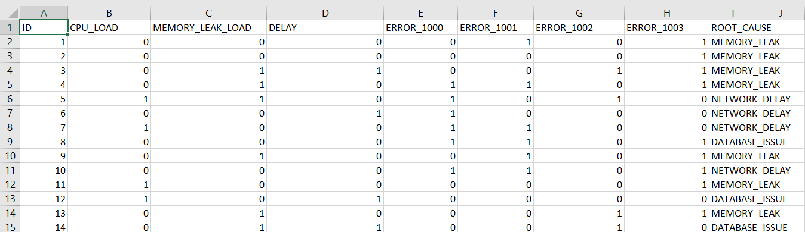
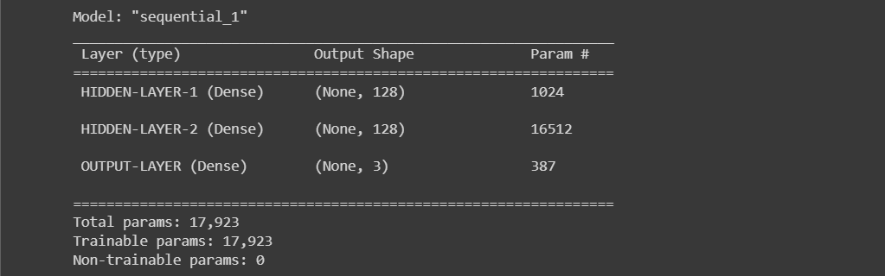
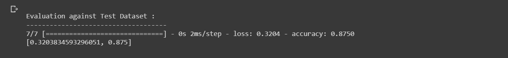
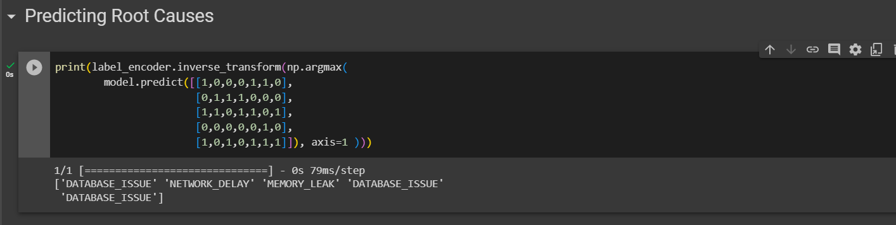

<h2>Incident-Root-Cause-Analysis-Deep-Learning-Classifcation</h2>
<h4>Dataset</h4>
A Data Center Team uses a system monitoring tool to track CPU memory application latency for all their servers becuase they wanted to predict causes of uses reported by customer.
 
This dataset has variabls such as <b>ID,CPU_LOAD,MEMORY_LEAK_LOAD,DELAY,ERROR_1000,ERROR_1001,ERROR_1002,ERROR_1003 and ROOT_CAUSE</b> 
Dataset is available for each incident indicating if any load isues or errors was observed during that problem 
 

<h4>Implimentation</h4>

1.Verbose = 1  
2.Batch = 64  
3.Epochs = 20  
4.Hidden_nodes = 128  
5.Validation_split = 0.2  

 
<h4>Model Summary</h4>

 
 

<h4>Evaluation against Test Dataset</h4>

 
 
<h4>Predicting Root Causes </h4>

